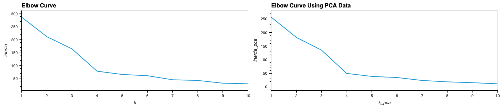
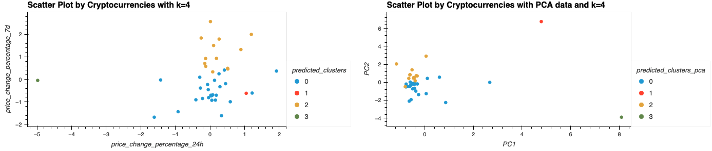

# Module-19-Challenge

## Analysis

Please refer to `Crypto_Clustering.ipynb` for answers to all the questions listed in the requirements. The following is the final finding and is also included in the `Crypto_Clustering.ipynb`.

**Elbow Curve Comparison**

The two elbow curve plots show the same optimal value for k, indicating that the best number of clusters isn't affected by applying PCA to the original scaled data. Additionally, the elbow curve using PCA data shows lower inertia, which suggests that the clusters are more compact.

**Clusters Comparison**

This is further reflected in the visualizations of the clusters: by comparing the two scatter plots, the clusters in the scatter plot using the original scaled data are more spread out, and the clusters using the PCA data are tighter and more distinct from one another.

Although applying PCA may result in a slight loss of accuracy, the total explained variance of the three principal components is 89.5% in this case, which is sufficent for analysis using the PCA data. In conclusion, using fewer features not only improves the distinction among the clusters but also makes the analysis process more efficient in this case.

## Resources

Resources that I referred to for completing this homework:

<https://chatgpt.com/>
